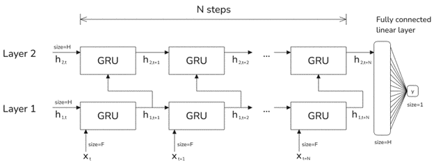
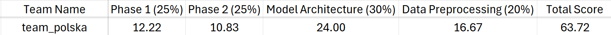

# **SPE ML Challenge 2025 – Team Polska**

This repository contains the code, report and the results for _Team Polska_ in the **SPE GCS ML Challenge 2025**. It includes scripts for **data pre-processing, model training, and inference** to reproduce our solution.

## **Problem statement**
The 2025 SPE GCS ML Challenge aimed to accurately predict the Bottom Hole Circulating Temperature (BHCT) for five wells. The problem was divided into two phases:
* Phase 1: Develop a single, generalized model to predict BHCT.
* Phase 2: Fine-tune the model for improved accuracy on new wells.
Participants were restricted from using pre-trained models or external datasets, such as the 
Geothermal Data Repository. Model performance was evaluated using the R-squared (R²) 
metric, measuring how well predictions matched actual values. The challenge reflected real-world constraints, including limited training data and variations in well conditions. 

## **Our approach**

The detailed report describing out approach and finidings is available at [report/SPE-GCS-ML-Challenge-2025-report.pdf](report/SPE-GCS-ML-Challenge-2025-report.pdf).


### Overview
After testing multiple architecture, we found that Gated Recurrent Unit (GRU) networks proved most effective for geothermal drilling data.

#### Best Model: GRU
- **Accurate, efficient, adaptable**
- Simplified architecture for faster training

#### Data Preparation
- **Last 500 rows** reserved for testing
- **Synthetic augmentation:** noise injection, random initialization

#### Performance
- **Median output** from 200+ models improves generalization
- **Mean Absolute Error (MAE)** for evaluation



## **Results**

Ranked 8th place in the final standings.



Head to the [results folder](results) to see how our predictions compared to the ground truth.


----------

## **Reproduction Steps**

### **1. Set Up the Environment**

Ensure you have **Python 3.10** installed. Then, create the environment and install dependencies:

```bash
pip install torch==2.5.1 torchvision==0.20.1 torchaudio==2.5.1
pip install -r requirements.txt
```

Next, copy the challenge dataset into the **`data/raw`** folder.

----------

### **2. Data Preprocessing**

To format the dataset for training, run:

```bash
bash ./preprocess.sh
```
The processed dataset will be saved in **`data/formatted`**.

----------

### **3. Training the Model**

#### **Configuring Training Parameters**

Before training, modify the configuration file **`config.py`**. It consists of two sections:

-   **`PARAMETERS WHICH CAN BE MODIFIED`** → Adjust these as needed.
-   **`DO NOT TOUCH`** → Leave these unchanged.

Key settings:

-   **Training wells:** Multiple wells from both phases can be used for training.
-   **Validation/Test well:** Exactly **one** well must be selected for validation/testing.
    -   Set **`P1_TEST_HOLE`** to **0, 1, or 2**, or **`P2_TEST_HOLE`** to **0 or 1**.
    -   They **cannot both** be `None`.
    -   The selected **test well must also be included in training**.
-   **Test size:** The last **N rows** of the test well will be used for evaluation.
    -   For final model submission, a small value (e.g., **16**) is recommended.

Example configuration:

```python
P1_TRAIN_HOLE: int | list[int] | None = 0  # Options: [0, 1, 2], 0, 1, 2, None
P1_TEST_HOLE: int | None = 0  # Options: 0, 1, 2, None

P2_TRAIN_HOLE: int | list[int] | None = None  # Options: [0, 1], 0, 1, None
P2_TEST_HOLE: int | None = None  # Options: 0, 1, None

TEST_SIZE: int = 16  # Number of last rows used for testing
```

#### **Running Training**

Once the configuration is set, train the model by running:

```bash
python train.py
```

Since our approach relies on an **ensemble of multiple models**, repeat the training process with different configurations. In our case, we trained approximately **40 models per well** to improve generalization.

----------

### **4. Inference**

After training sufficient models, generate predictions and validation results for all models:

```bash
python generate_all_models_prediction_and_validation.py
``` 

Once complete, aggregate all predictions into a final output:

```bash
python combine_final_predictions.py
```

Final predictions will be saved in the **`predictions`** folder.
